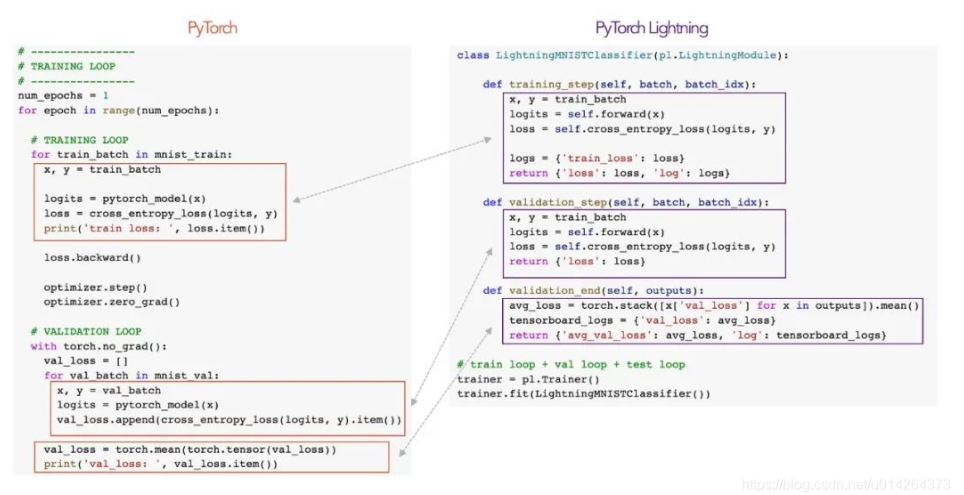
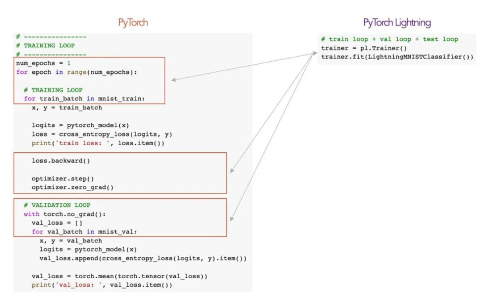
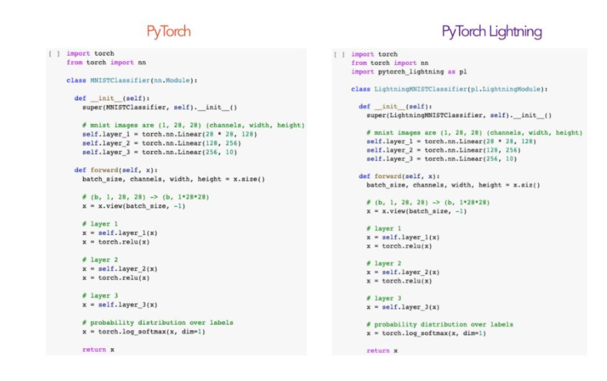

# **unKR框架编写指南**

## 说明

本指南用于说明在基于当前框架的基础上，如何对各个模块进行编写，实现对应论文中的模型。


## 参数配置与调试

**模型的参数设置在config下的yaml文件中，需要修改yaml文件以适配自己的模型**，各位同学在具体编写时可以参照config文件夹下已有的yaml文件设置自己模型的部分重要参数，常用参数包括但不限于下列几条：

```
data_class: 选取读入数据时的处理模块（这部分可能对于不同的数据集格式需要自行实现），如KGDataModule，后文会说明如何根据自己的数据集形式重写函数
data_path，dataset_name：自己使用的数据集的路径和名称
emb_dim：嵌入向量的维度
eval_bs：执行评估任务（验证和测试）时的batch_size
eval_task：评估任务的类型
litmodel_name：使用pytorch lightning部分的模型名称
loss_name：使用损失函数的名称
num_neg：负样本和正样本之比
model_name：使用的model名称（此处需与litmodel_name进行对应）
train_bs：执行训练任务时的batch_size
test_only：如果需要训练则设为false，仅用于测试结果设为true
lr：学习率
check_val_every_n_epoch：每隔多少个epoch进行一次验证
early_stop_patience：在验证集上指标多少次没有改进，就早停
```

## 数据集

将自己的数据集放在dataset目录下（如果数据集格式与当前已存在的cn15k,nl17k,ppi5k的格式不同，则需要重写数据处理模块或将数据整理为相同格式）

## 🍺数据处理模块（可选）

**如果数据集格式与当前已存在的cn15k,nl17k,ppi5k的格式相同，则不用修改这部分；如果数据格式不同则需要重点修改**。

**注：如果使用相同格式但不同名的数据集，只需在src/unKR/data/DataProcess.py中的UKGData类的get_id函数中，train.tsv、val_tsv、test.tsv对应的部分修改文件名称，即可使用自己的数据集。**

如果数据格式不同，则进入src/unKR/data/DataProcess.py，仿照UKGData的格式构造一个新类。需要重写的函数为get_id函数。其中需要根据输入数据的格式来将数据导入到train_triples、valid_triples和test_triples中。这部分可以仿照unKR当前已经写好的get_id来进行编写。

这部分重要的数据结构为ent2id、rel2id；以及train_triples、valid_triples和test_triples。ent2id、rel2id是字典，存储实体/关系和id的对应关系；train_triples、valid_triples和test_triples是列表，存储对应数据集的四元组。

以训练集部分的数据处理为例，对于传入数据的每一条四元组而言，需要首先通过数据处理对应使得ent2id和rel2id这两个字典分别存放实体/关系和id的对应情况。最后让train_triples这一列表存储每一次处理后得到的四元组。验证集与测试集的处理方式类似。这部分可以根据对应格式的数据集灵活调整，只要保证最终的ent2id、rel2id格式及train_triples、valid_triples、test_triples格式与示例相同即可。

示例如下：

```
ent2id: {'4001': 0, '4176': 1, '3810': 2, '4338': 3, '3984': 4, '4158': 5, '2453': 6, '2130': 7, '324': 8, '145': 9, '50': 10, '250': 11, '2276': 12, '2076': 13, '3901': 14, '4189': 15}
```

```
rel2id: {'5': 0, '0': 1, '6': 2, '2': 3, '3': 4, '1': 5, '4': 6}
```
```
valid_triples: [(498, 3, 151, 0.37), (1980, 4, 1037, 0.472), (642, 5, 706, 0.181), (272, 1, 481, 0.571), (95, 5, 1299, 0.205), (320, 3, 859, 0.337), (988, 2, 523, 0.36), (704, 1, 489, 0.333)]
```


## 🍺数据采样模块（可选）

**如果数据已经在数据处理模块中处理地与标准一致，且使用UniSampler进行采样的话，这部分不需要重写。**

UKGEBaseSampler在DataProcess.py中，**一般情况下不用重写基础的采样类**，但是如果数据类型并非不确定性知识图谱,则需重写基础的采样类，进入src/unKR/data目录下的DataProcess.py函数新写一个类，该类需继承UKGData类。

**需要根据论文的采样方式来重写UKGESampler.py中的内容**，如果采样器已在neuralkg的源码中，可以不做过多修改，但是由于不确定性知识图谱比知识图谱的三元组多了一个置信度，因此在涉及到遍历的过程中，需要添加一个参数，例如在重写UKGEUniSampler的过程中，需要把neuralkg中的：

```python
for h, r, t in data:
    neg_head = self.head_batch(h, r, t, self.args.num_neg)
    neg_ent_sample.append(neg_head)
    if self.args.use_weight:
        weight = self.count[(h, r)] + self.count[(t, -r-1)]
        subsampling_weight.append(weight)
```

改为：

```python
for h, r, t, _ in data:
    neg_head = self.head_batch(h, r, t, self.args.num_neg)
    neg_ent_sample.append(neg_head)
    if self.args.use_weight:
        weight = self.count[(h, r)] + self.count[(t, -r - 1)]
        subsampling_weight.append(weight)
```

如果采样方式在neuralkg中没有涉及，则需根据采样逻辑构造自己的采样模块。

## 🔥model部分（必写）

model部分是重写过程中的核心部分之一，需要根据自己负责的模型进行特异化地编写。

首先需要进入src/unKR/model文件夹，然后根据模型类型新建python文件包进行编写。文件包下应该包含model.py以及一个具体的模型（如果模型比较特殊也可以不使用model.py，直接把所有功能写在一个具体的模型类中），model.py里包含的是这一类模型的父类（例如当前unKR下的model.py就是所有嵌入模型的父类，其中包含有tri2emb这一重要函数）。

在编写完model.py后，需按照模型的具体逻辑编写对应的模型。模型中应包含forward函数以及实现部分重要功能的函数（这些函数可能会为计算loss或者部分指标提供帮助）。

**注：model和lit_model的区分边界：model部分在实现时，不用考虑训练、验证和测试的具体实现，而是为了获得训练过程及其他计算过程中所必要的数据。具体的训练过程是在lit_model中完成的。**

以UKGE（即不确定性知识图谱嵌入类模型）为例进行说明，这里的init_emb函数是为了获得三元组嵌入的初始化。而score_func函数是为了计算三元组的得分，这对后续计算loss是非常关键的。在forward函数中调用了tri2emb和score_func函数并返回三元组得分，因此在每次调用模型的过程中都可以更新三元组的嵌入并获得三元组得分（实现Litmodel时会直接通过调用model的方式调用到forward函数的）

## 🔥lit_model部分（必写）

lit_model部分是重写过程中的核心部分之一，需要根据自己负责的模型进行特异化地编写。**（如果模型训练及验证过程与UKGE相似，可以直接使用UKGELitModel）**

首先需要进入src/unKR/lit_model文件夹，一般情况下不需要重写BaseLitModel，而是根据需要新创建一个python文件写一个lit_model类，这个新的lit_model类需要继承BaseLitModel。下以UKGELitModel为例描述lit_model模块需要写的内容。

forward函数不用修改，直接call model即可，需要重点实现的函数为training_step、validation_step、validation_epoch_end、validation_epoch_end、test_step、test_epoch_end。

**training_step为训练过程中的一步，最终需要返回一个可以被进行反向传播计算的loss张量**。这里传入的batch即为一个批次中所用到的训练数据（batch的大小与yaml文件中的训练批次数量有关）。在UKGELitModel中，training_step就是先调用model获取score，然后调用loss中的函数（下文会提）计算得到loss的。

**validation_step为验证过程中的一步，这里实现的逻辑一般是调用评测任务（下文会提）获取评测的结果并加以存储。**UKGELitModel中这里就是获取了MAE和MSE并加以存储。这里传入的batch即为一个批次中所用到的测试/验证数据，可是这里的batch与训练中的batch不一定相同，这也是取决于yaml文件中的验证批次数量的设置。

validation_epoch_end为validation_step执行结束后需要做的一步，UKGELitModel中即为存储输出结果以供后续输出或其他计算所用。

test_step和test_epoch_end与validation中的部分相似，如果测试过程中没有需要特别执行的逻辑，可以和validation保持一致。

configure_optimizers是重写了pytorch lightning中的优化器方法，根据论文的对应要求进行设置即可。

### pytorch_lightning 和 pytorch的对应关系

为了更便于大家理解pytorch_lightning中每一步的含义，这里用两张图来展示pytorch_lightning相比于pytorch的区别和对应关系。

下面以使用pytorch和pytorch lightning实现相同训练过程的代码为例进行说明。

通过下图可以更加清楚地看到training_step、validation_step、validation_epoch_end中需要实现的逻辑：



pytorch_lightning使我们可以更关注每一步逻辑的具体实现，而不用关注训练过程中的具体步骤（例如循环、反向传播、梯度归零等），**实现研究代码与工程的解耦**，通过自动化大多数训练循环和棘手的工程设计，减少了容易出错的情况，因此非常适合我们这种强调一致性的开发，如下图所示，pytorch_lightning利用fit封装了大量的训练具体步骤：



事实上，除了训练过程和测试过程的实现外，pytorch_lightning和pytorch在模型实现上非常相似，对照关系如下：



更多pytorch_lightning知识可以参考以下文档：

https://zhuanlan.zhihu.com/p/556040754

https://blog.csdn.net/u014264373/article/details/117021901

## 🔥loss部分（若论文中有新提出的损失函数 必写）

loss部分是核心部分之一，loss在lit_model的training_step中被调用。

进入src/unKR/loss文件夹新建python文件进行重写，loss的重写方式比较简单，继承nn.Module，然后重写forward函数，实现论文中所描述的损失函数逻辑，在forward函数的最后返回loss即可。注意文件名需与yaml里的损失函数名称一致。

## 🍺eval_task部分（可选）

eval_task即评测任务，如果评测任务已被实现，则可直接在yaml中选择调用，如果想实现自己的评测任务，需进入src/unKR/eval_task文件夹新建python文件进行重写，eval_task在validation_step和test_step被调用。

这里在重写时没有需要特意注意的格式，但是需综合考虑validation_step/test_step环节传入的参数并实现对应的评测逻辑和返回的评测指标格式。

## 🍺xxxxdemo.py（可选）

原则上demo文件不用修改，但是如果在调试过程中想直接在demo文件中加上评测任务的实现或者某些处理，可以在demo文件中进行修改，这里指出demo文件中的几个重要节点。

训练：调用trainer.fit

```python
if not args.test_only:
    # train&valid
    trainer.fit(lit_model, datamodule=kgdata)
    # 加载本次实验中dev上表现最好的模型，进行test
    path = model_checkpoint.best_model_path
```

测试：调用trainer.test

```python
lit_model.load_state_dict(torch.load(path)["state_dict"])
lit_model.eval()
trainer.test(lit_model, datamodule=kgdata)
```

如果不想进行训练，直接利用当前已有的模型进行测试，可以在yaml中将test_only参数设为false，然后在

```python
if not args.test_only:
    # train&valid
    trainer.fit(lit_model, datamodule=kgdata)
    # 加载本次实验中dev上表现最好的模型，进行test
    path = model_checkpoint.best_model_path
else:
    # path = args.checkpoint_dir
    path = "./output/confidence_prediction/ppi5k/UKGE/epoch=5-Eval_MSE=0.052.ckpt"
```

的部分中，else之后的path部分放入待测试的模型路径。

## 执行

可以创建一个xxxxdemo.py进行执行和测试，这份文件就是为main.py传入了yaml配置文件，修改时在main函数中传入自己的yaml地址即可。训练/测试时在xxxxdemo.py进行运行即可。
